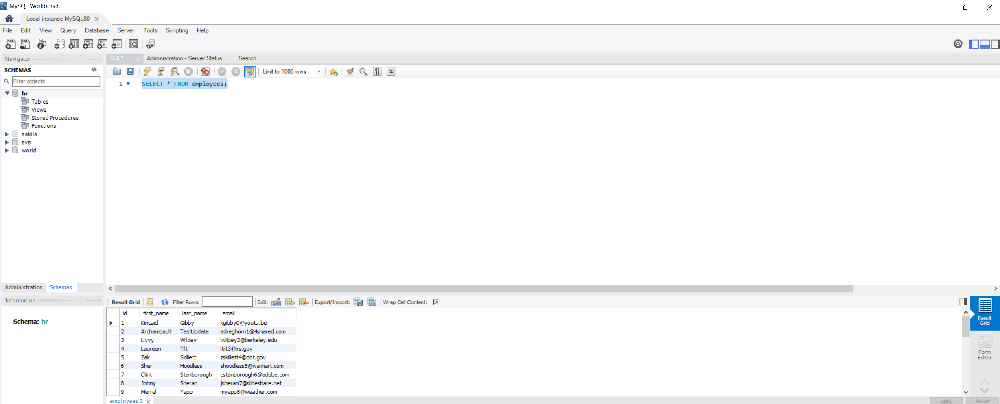
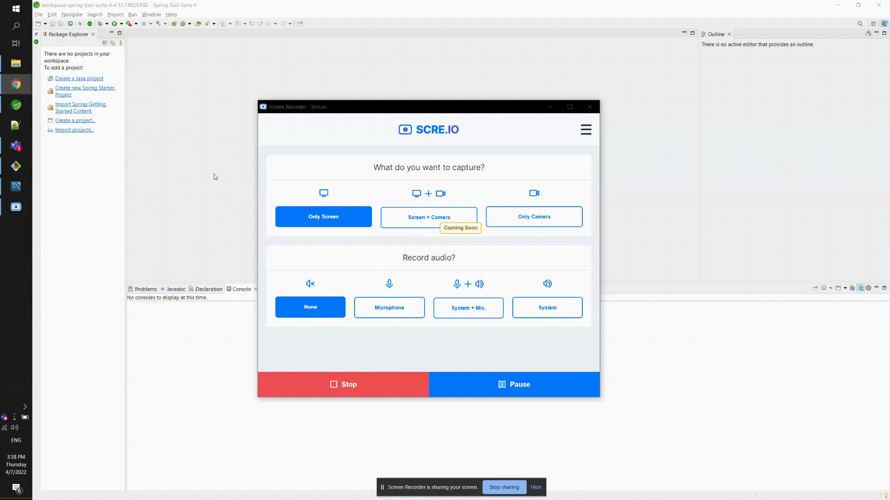
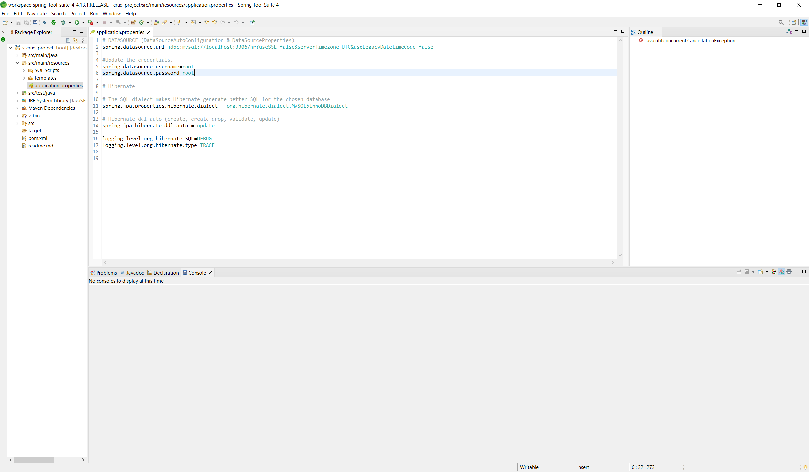
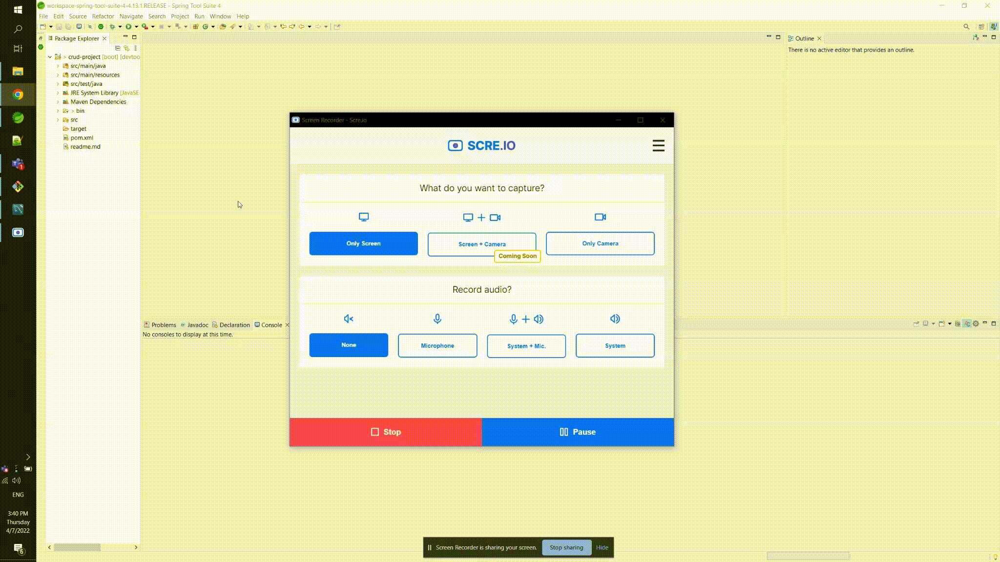
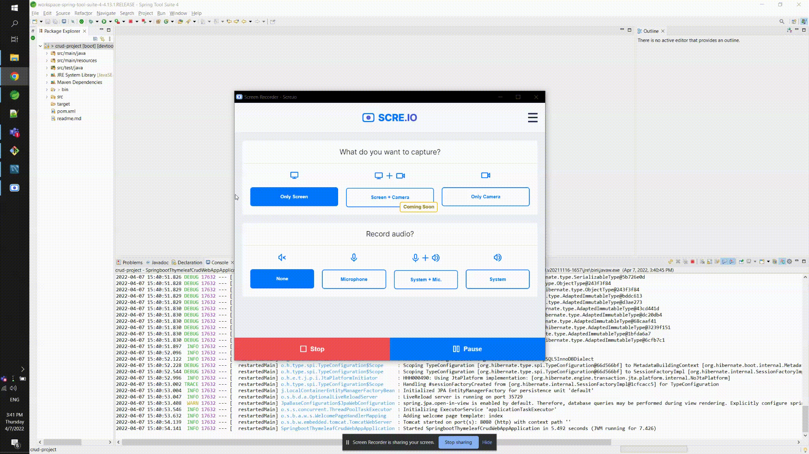

# Dependencies
This project requires **[Java 8](https://www.oracle.com/ph/java/technologies/javase/javase8-archive-downloads.html)**.
* [MySQL Workbench](https://dev.mysql.com/downloads/workbench/)
* [Spring Tools STS](https://spring.io/tools)

*Note: You will be needing a RFNS for the installation of the software/apps*

# Environment Setup

### DB Setup
1. Run the SQL script from `src/main/resources/SQL Script/SQL.sql` [SQL.sql](src/main/resources/SQL%20Scripts/SQL.sql) to your MySQL Workbench
2. To check if you successfully created the data run `SELECT * FROM employees;`
    

### Running The Application
1. Import the project to your Spring STS
    
2. Edit the `application.properties` for the DB credentials
    
3. To run the right click the folder, then select **Run As** then choose **Spring Boot App**
    
4. Access the app to your browser http://localhost:8080/
    
"# employee-management-system-in-memory-db" 
"# employee-management-system-in-memory-db" 
"# employee-management-system-in-memory-db" 
